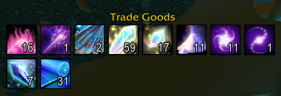
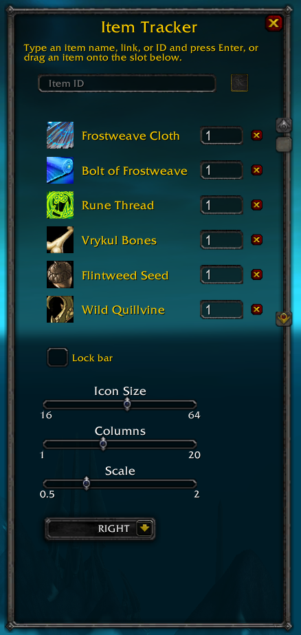
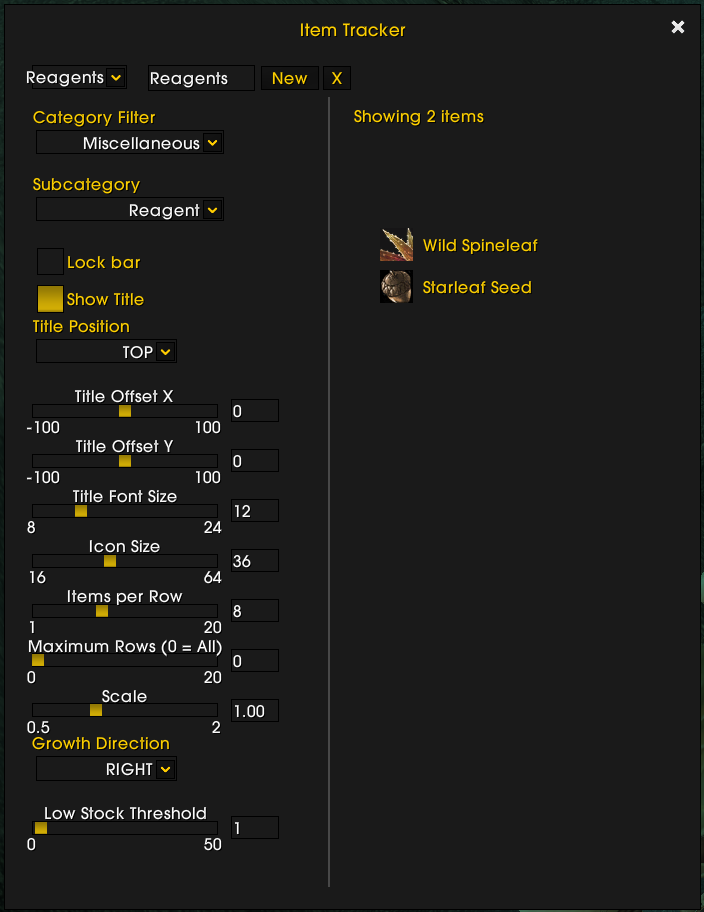

# ItemTracker

A configurable, movable, action-bar-style item tracker addon for **World of Warcraft 3.3.5a (Wrath of the Lich King)**.

Pick any items you care about — flasks, enchanting mats, quest tokens, whatever — and ItemTracker shows a small row of icons with live bag+bank counts, right on your screen, styled to match your UI (with optional ElvUI support).

> Not compatible with retail WoW. Built and tested against a 3.3.5a private server client.

<!-- TODO: hero screenshot showing the tracker bar in a normal play session -->


## Features

- **Live counts** — bag + bank totals, updated automatically as you loot, use, trade, or visit the bank.
- **Add items your way** — type a name, paste an item link, type a numeric item ID, or just drag the item onto the config window.
- **Low-stock warnings** — set a per-item threshold; the icon and count turn red when you're running low.
- **Fully configurable bar** — icon size, columns, growth direction (right/left/down/up), scale, and lock-in-place.
- **Movable** — drag the bar (or any icon on it) to reposition; position is remembered per character.
- **Optional ElvUI skin** — automatically matches ElvUI's flat style if you have it installed; looks and works fine without it too.

<!-- TODO: screenshot of the full config window (add row, tracked item list, bar options) -->


<!-- TODO: side-by-side or before/after screenshot showing the bar/config window with ElvUI's skin applied -->


## Installation

1. Grab the latest zip from the [Releases page](../../releases), or copy/symlink the `ItemTracker/` folder from this repo directly.
2. Extract (or place) it into your WoW `Interface/AddOns/` directory, so you end up with `Interface/AddOns/ItemTracker/ItemTracker.toc`.
3. Make sure it's enabled at the character-select AddOns list.
4. Log in — that's it, no configuration required to get started.

## Usage

Open the config window with:

```
/itemtracker
```
or the shorter
```
/itr
```

From there:
- Type an item's name, paste its link (shift-click it), or type its numeric ID into the box and press Enter — or just drag the item onto the slot next to it.
- Set a threshold on any tracked item; its count turns red once you drop below that number.
- Adjust icon size, columns, growth direction, and scale with the sliders/dropdown — the bar updates live as you change them.
- Drag the bar (or click-drag any icon on it) to reposition it, then check "Lock bar" to keep it in place.
- Press Escape or click the × to close the config window.

## Known Limitations

- Bank-inclusive counts only refresh live while the bank window is open this session — a 3.3.5 client limitation, not something an addon can work around.
- No reagent bank support (it didn't exist yet in 3.3.5).
- Per-character only — tracked items, thresholds, and bar settings don't carry over between characters.

## Development

Pure Lua, zero third-party libraries. The addon's dependency-free logic (`Defaults.lua`, `Threshold.lua`, `ItemInput.lua`, `ItemList.lua`, `BarLayout.lua`) has real unit tests runnable with a standalone Lua interpreter:

```bash
lua tests/defaults_test.lua
lua tests/threshold_test.lua
lua tests/iteminput_test.lua
lua tests/itemlist_test.lua
lua tests/barlayout_test.lua
```

This addon was built with [Claude Code](https://claude.com/claude-code) using its Superpowers skill set (spec → plan → subagent-driven implementation → in-game testing/fixes).
